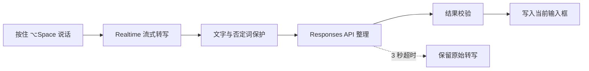

<p align="center">
  
</p>

<h1 align="center">SayQuery</h1>

<p align="center"><strong>Speak naturally. Prompt clearly.</strong></p>

<p align="center">
  按住快捷键说话，将自然口语实时整理成清晰、可靠、适合 AI 阅读的 Query，并写回当前输入框。
</p>

<p align="center">
  
  
  
  
</p>

---

SayQuery 是一个原生 macOS 菜单栏应用。它监听全局 `⌥Space` 按住说话，通过流式语音识别获得增量转写，再把口语中的重复、跳跃和填充词整理成结构清晰的 AI 输入。

> [!IMPORTANT]
> SayQuery 目前处于 Alpha 阶段。静态检查和本地构建已通过，但真实云端链路、不同第三方输入框和低延迟目标仍需要更多端到端验证。

## 为什么用 SayQuery

| | |
|---|---|
| 🎙️ **按住即说** | 使用全局 `⌥Space`，松开后立即完成整理。 |
| ⚡ **流式优先** | 录音期间持续接收转写，减少松开按键后的等待。 |
| ✨ **面向 AI 整理** | 提供轻度整理和结构化 Query 两种模式。 |
| 🧷 **保留关键信息** | 校验数字、URL、路径、代码、ID 和否定词，减少语义漂移。 |
| 🪟 **跨应用写入** | 通过 macOS 辅助功能写入当前输入框，不支持时退回剪贴板粘贴。 |
| 🔌 **支持兼容中转站** | 可分别配置整理接口、Realtime WebSocket 接口和模型名称。 |
| 🔐 **本机保存密钥** | API Key 仅保存在 macOS Keychain，不写入仓库或配置文件。 |
| 📊 **可见延迟** | 菜单栏窗口显示转写、整理和总体耗时。 |

## 工作方式



录音只在按键期间进行。松开快捷键后，SayQuery 等待最终转写并发起整理；总体等待超过 3 秒时停止，并保留已经收到的转写结果。

## 快速开始

### 环境要求

- macOS 14 或更高版本
- Swift 5.10 或更高版本
- 支持所需协议的云端服务及个人 API Key

完整 Xcode 不是构建这个 Swift Package 的必要条件。

### 构建并启动

```bash
git clone https://github.com/layinginbed/sayquery.git
cd sayquery
swift run SayQueryChecks
./scripts/build-app.sh
open dist/SayQuery.app
```

### 首次设置

1. 打开菜单栏中的 SayQuery。
2. 在“设置”中填写个人 API Key，并保存。
3. 按系统提示授予麦克风权限和辅助功能权限。
4. 把光标放入目标输入框。
5. 按住 `⌥Space` 说话，松开后接收整理结果。

默认关闭“校验通过后自动写入”。关闭时，结果会保留在菜单栏窗口中，供你确认、复制或手动写入。

## 云端服务配置

SayQuery 默认使用 OpenAI 接口，也可以连接兼容的第三方中转站。

| 配置项 | 默认值 | 兼容要求 |
|---|---|---|
| 整理接口 | `https://api.openai.com/v1/responses` | 兼容 Responses API 和 `text.format` Structured Outputs |
| 整理模型 | `gpt-5.6` | 支持所用结构化输出 Schema |
| Realtime 接口 | `wss://api.openai.com/v1/realtime` | 兼容 Realtime WebSocket 转写协议 |
| 转写模型 | `gpt-live-transcribe` | 支持增量转写事件 |

兼容的 Realtime 服务必须支持 `session.update`、`input_audio_buffer.append` 和转写增量事件。两条链路目前都使用 `Authorization: Bearer <API Key>`。

仅提供 `/v1/chat/completions` 或普通 `/v1/audio/transcriptions` 的中转站不能直接用于当前低延迟链路。远程接口必须使用 `https` 和 `wss`；只有 `localhost` 可以使用 `http` 或 `ws`。

## 延迟目标

以下数字是设计验收目标，不是当前环境的实测结果。

| 阶段 | 目标 |
|---|---:|
| 松开快捷键到最终转写 | 通常不超过 800 ms |
| Query 整理 | 通常不超过 1,000 ms |
| 松开快捷键到结果就绪 | 中位数不超过 1.5 s，P95 不超过 3 s |
| 超时降级 | 3 s 后停止等待并保留实时转写 |

Structured Outputs 首次使用新 Schema 时可能产生额外延迟。评估性能时，应分别统计冷启动和热请求。

## 隐私与安全

- SayQuery 是个人 BYOK（Bring Your Own Key）工具，不内置共享的服务端 API Key。
- 当前同一个 API Key 会发送给配置的整理接口和 Realtime 接口。不要把 OpenAI Key 发送给不受信任的中转站。
- 云端服务会收到按键期间的原始音频和对应转写。数据保存与使用规则由服务提供方决定。
- SayQuery 不读取屏幕、历史对话或输入框中的既有内容。
- Responses API 整理请求会携带 `store: false`。
- 辅助功能无法直接写入时，应用会使用剪贴板粘贴；整理结果将留在系统剪贴板中。
- 安全输入框中禁用自动写入。

如果要向其他用户分发应用，应增加受控后端和短期客户端凭据，不要把开发者 API Key 打包进客户端。

## 当前验证状态

已验证：

- `swift run SayQueryChecks`
- `swift build --product SayQuery`
- 应用包构建、`codesign --verify` 和 `plutil -lint`

尚未验证：

- 使用真实 API Key 的完整云端调用
- Safari、Chrome、Electron 和不同原生应用输入框的兼容矩阵
- 冷启动、热请求和弱网环境下的延迟分布

## 路线图

- [ ] 增加可重复的真实链路延迟基准
- [ ] 建立常见 macOS 应用输入框兼容矩阵
- [ ] 增加可选的本地转写后端
- [ ] 提供签名、公证和可下载的 Release

欢迎通过 [Issues](https://github.com/layinginbed/sayquery/issues) 提交兼容性问题和功能建议。
